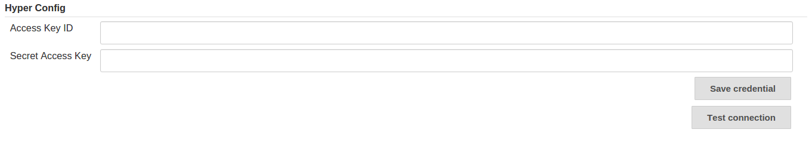

# hyper-commons-plugin
=======================

This plugin provides common functions for integrate Jenkins with Hyper_.

<!-- TOC depthFrom:1 depthTo:6 withLinks:1 updateOnSave:1 orderedList:0 -->

- [Features](#features)
- [Use plugin](#use-plugin)
	- [Prerequisites](#prerequisites)
	- [Install plugin by manually](#install-plugin-by-manually)
	- [Config plugin](#config-plugin)
- [Build plugin](#build-plugin)
	- [Prerequisites](#prerequisites)
	- [Compile](#compile)
	- [Test](#test)
	- [Package](#package)
	- [Install](#install)

<!-- /TOC -->

# Features
Plugin currently support following features:

- Install hyper cli
- Set Hyper_ credentials
- Test connection to your account.


# Use plugin

## Prerequisites

- Jenkins
- hypercommon.hpi
- Hyper_ credential

## Install plugin by manually

open Jenkins Web UI in web browser

get pre-build `hypercommon.hpi`

```
Manage Jenkins -> Manage Plugins -> Advanced -> Upload Plugin
```

## Config plugin

login https://console.hyper.sh to get a `Hyper_ credential`.

```
Manage Jenkins -> Configure System -> Hyper Config
```


# Build plugin

## Prerequisites

- java 1.8+
- maven 3+

## Compile
```
$ mvn compile
```

## Test

compile + test

```
$ mvn test
```

## Package

> **output**: target/hypercommon.hpi

compile + test + package

```
$ mvn package

//skip test
$ mvn package -DskipTests
```

## Install

> **target**: /.m2/repository/sh/hyper/plugins/hypercommon/1.0-SNAPSHOT/hypercommon-1.0-SNAPSHOT.hpi

compile + test + package + install

```
$ mvn install

//skip test
$ mvn install -DskipTests
```
